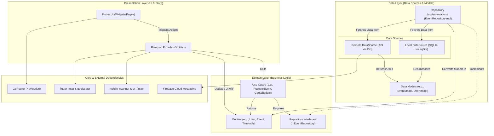

# Software Architecture Diagram

The Smart Campus Operations System utilizes **Clean Architecture** combined with **Feature-First Project Structuring**.

### Architecture Breakdown:

1. **Presentation Layer**: 
   - Handles everything the user interacts with. UI is built with standard Flutter widgets.
   - **Riverpod** is used to separate UI from logic. It listens to changes in the data and triggers UI rebuilds.

2. **Domain Layer**:
   - Contains the core business logic independent of frameworks. 
   - **Entities**: Pure Dart classes representing real-world objects in the app (e.g., `Event`, `User`).
   - **Use Cases**: Encapsulate specific business rules (e.g., logic to verify if an event has capacity before registering).
   - **Repository Interfaces**: Abstract contracts defining what data operations are possible without dictating how they are performed.

3. **Data Layer**:
   - Responsible for data retrieval and storage.
   - **Repository Implementations**: Fulfill the domain layer's interfaces. Decides whether to fetch data from the local cache (`SQLite`) or a remote API.
   - **Models**: Extensions of Domain Entities that include JSON/Map serialization for databases and APIs.
   - **Data Sources**: Handle raw data operations (e.g., SQL queries, HTTP requests).
