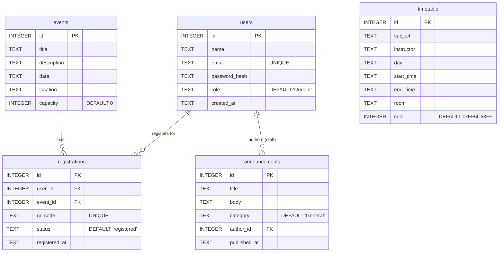

# Database Entity-Relationship (ER) Diagram

The following is the Entity-Relationship Diagram for the Smart Campus Operations System SQLite database.

### Table Descriptions:
- **`users`**: Stores authentication credentials, basic info, and the user's role (`student` or `staff`).
- **`events`**: Defines events created by staff, including their capacity and location.
- **`registrations`**: Acts as a junction table between `users` and `events`. It holds the unique `qr_code` generated for a user's ticket and tracking `status` (e.g., 'registered', 'checked-in').
- **`announcements`**: Stores broadcast messages. The `author_id` references the staff member who created the announcement.
- **`timetable`**: Stores schedule entries, mapping subjects to times, days, and rooms.
